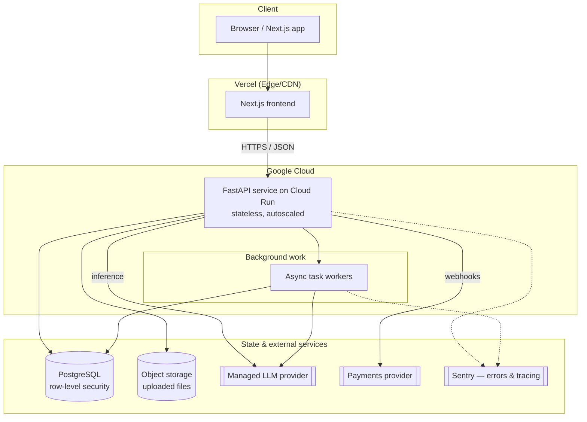
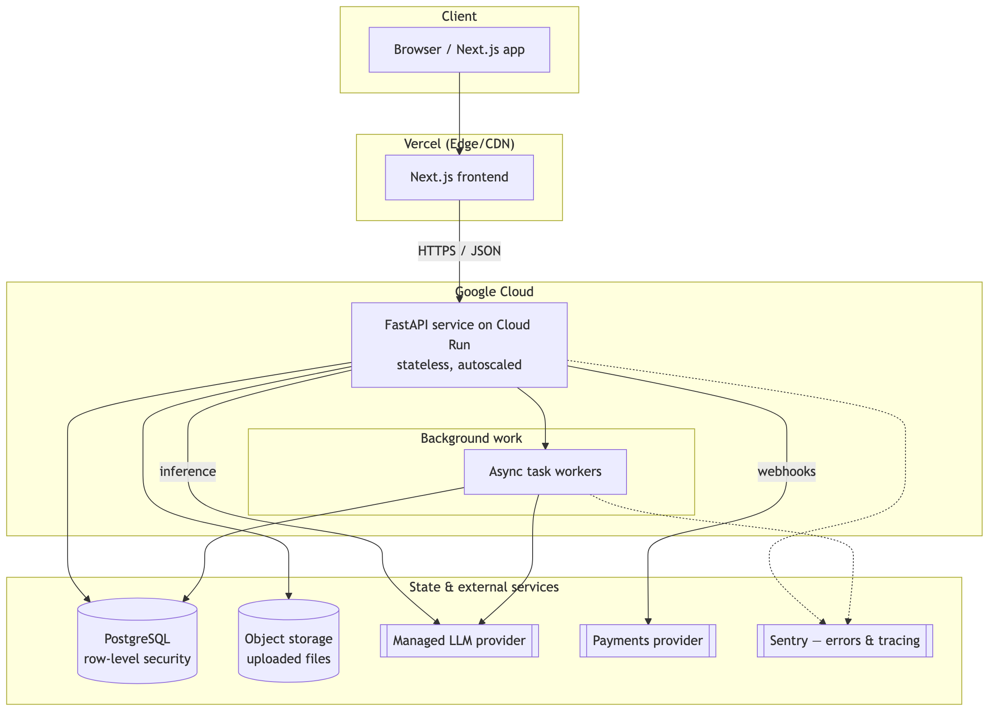
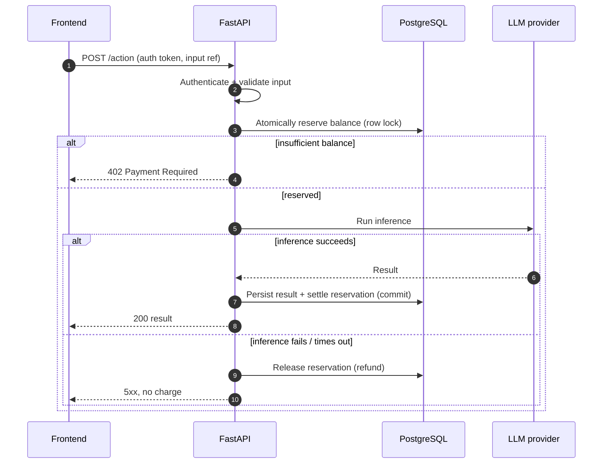
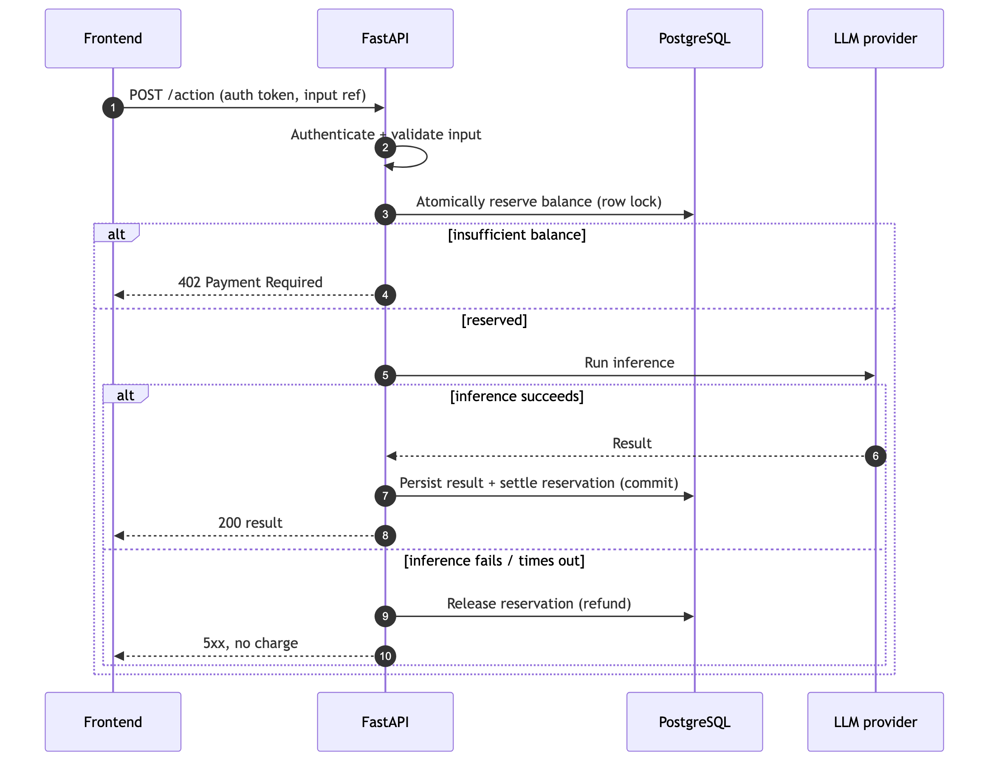
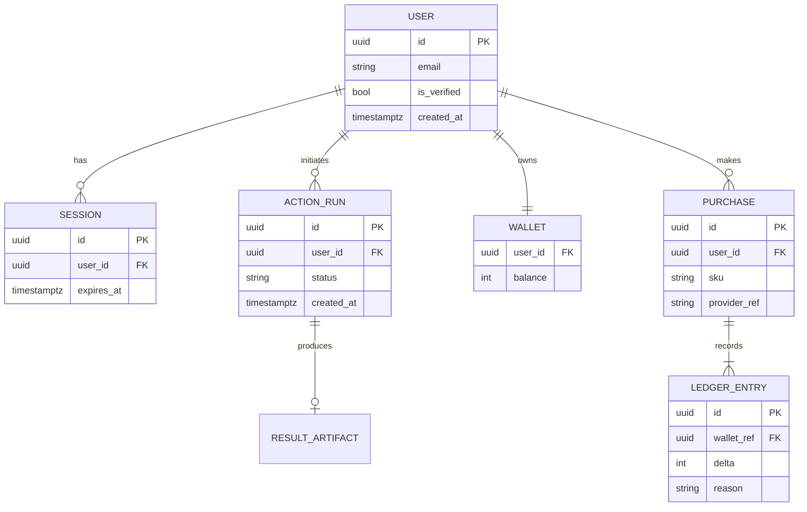
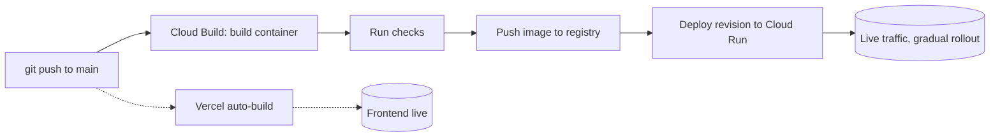
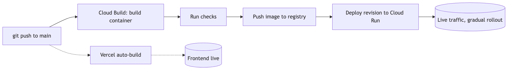

# System-Design Case Study — A Production AI Service

> A walkthrough of how I architected, deployed, and operate **ATSAlign**
> ([atsalign.com](https://www.atsalign.com)) — an AI-powered ATS resume checker
> and optimizer that tailors resumes to any job description — running as a
> production AI service handling real traffic on Google Cloud. This repository
> documents **system design and
> engineering decisions**. Application source, AI prompts, and ranking logic are
> proprietary and intentionally excluded.

---

## What this is (and isn't)

This is a **design case study**, written the way I'd whiteboard the system in an
interview. It covers the architecture, the trade-offs behind each choice, the
data model, how it's deployed, and how I keep it secure and reliable.

It deliberately **does not** include the product's core IP — the AI prompts, the
scoring/ranking logic, or the optimization pipeline. Where those touch the
design, I describe the *engineering pattern* (e.g. "an async job with reserve →
process → settle semantics") rather than the domain logic inside it.

---

## Table of contents

- [System at a glance](#system-at-a-glance)
- [Architecture](#architecture)
- [Request lifecycle](#request-lifecycle)
- [Tech stack & why](#tech-stack--why)
- [Data model](#data-model-sanitized)
- [Security](#security)
- [Scalability & reliability](#scalability--reliability)
- [Deployment & CI/CD](#deployment--cicd)
- [Engineering challenges & lessons](#engineering-challenges--lessons)
- [Roadmap](#roadmap)

---

## System at a glance

A user uploads a document and a target description; the service runs an
LLM-backed analysis and returns structured results. Paid actions draw down a
metered balance. The system is a **stateless FastAPI backend** on Cloud Run, a
**Next.js frontend** on Vercel, and **PostgreSQL** as the system of record, with
object storage for files and a managed LLM provider for inference.

**Design goals that drove the architecture**

- **Stateless services** so the compute tier scales to zero and back under spiky traffic.
- **Correct billing under failure** — a user is never charged for an inference that didn't complete.
- **Fast, cheap reads** — expensive LLM work is cached per owner so repeat views don't re-pay for inference.
- **Security by default** — row-level security on the database, secrets out of the codebase, PII minimized.

---

## Architecture

<!-- fallback image; GitHub renders the Mermaid above natively -->

Architecture diagram (PNG)

The backend is the only writer to the database. The frontend never talks to the
database, the LLM provider, or object storage directly — every privileged action
goes through the API, which owns authentication, authorization, validation, and
billing.

---

## Request lifecycle

A representative **metered AI action**, shown as the generic engineering
pattern — *reserve → process → settle* — without the domain logic inside the
"process" step.

<!-- fallback image; GitHub renders the Mermaid above natively -->

Request lifecycle diagram (PNG)

The key property: **the balance is reserved before the expensive call and
settled or refunded atomically after it.** A crash mid-inference releases the
reservation — the user is never charged for work they didn't get. Repeat reads
of an already-computed result are served from a per-owner cache and cost nothing.

---

## Tech stack & why

The *why* matters more than the *what* — here's the reasoning behind each choice.

| Layer | Choice | Why this, over the alternatives |
|---|---|---|
| Backend | **FastAPI (Python)** | First-class async for I/O-bound LLM calls; Pydantic gives validation + typed contracts + OpenAPI for free. |
| Compute | **Google Cloud Run** | Stateless containers that scale to zero — I pay for requests, not idle VMs. No cluster to babysit vs. self-managed Kubernetes. |
| Frontend | **Next.js on Vercel** | SSR/SSG for SEO-critical pages; zero-config previews and CDN; clean split from the API. |
| Database | **PostgreSQL** | Relational integrity for billing/accounts; row-level security enforces tenant isolation at the engine, not just in app code. |
| File storage | **Object storage (S3-compatible)** | Keeps large binaries out of the DB and off the app tier; signed, time-limited access. |
| Inference | **Managed LLM provider** | Buy capability, not GPUs. Provider abstracted behind an internal interface so the model is swappable. |
| Errors/tracing | **Sentry** | Exceptions + performance traces across API and workers, tied to releases. |
| CI/CD | **Cloud Build** | Push to `main` → build → deploy, no manual steps. |

---

## Data model (sanitized)

A high-level view of the **plumbing** entities. Tables and columns that encode
proprietary logic (scoring, weighting, ranking) are intentionally omitted.

<!-- fallback image; GitHub renders the Mermaid above natively -->

ER diagram (PNG)

**Design notes.** Billing is modeled as an append-only **ledger** rather than a
mutable counter, so every balance change is auditable and reservations/refunds
are just ledger entries. Isolation between users is enforced by **row-level
security** in PostgreSQL — the backend connects as an owner role and every policy
is scoped by user.

---

## Security

- **Row-level security** on user-facing tables — tenant isolation at the database engine, defense in depth beyond app-layer checks.
- **Secrets never in the repo** — all credentials injected as runtime environment on Cloud Run / Vercel.
- **Verified-email gating** on privileged actions, with third-party-login accounts treated correctly (a subtle bug here once silently blocked verified users — see lessons).
- **Rate limiting** on public and metered endpoints to blunt abuse and cost-amplification.
- **Input validation everywhere** via Pydantic schemas at the API boundary; file uploads validated by type and size before storage.
- **Least-privilege access** to object storage via signed, expiring URLs.
- **PII minimization** — store what's needed, documented in a data-processing inventory.

---

## Scalability & reliability

- **Stateless compute** → Cloud Run scales horizontally on concurrency and to zero when idle; no sticky state to coordinate.
- **Caching of expensive work** → completed LLM results are cached per owner, so repeat reads never re-run inference (latency and cost both drop). *(Strategy only — cache keys and policies are internal.)*
- **Atomic billing under failure** → reserve-before-work + settle-or-refund guarantees no charge without delivery.
- **Async background work** for long-running tasks so request handlers stay responsive.
- **Observability** → Sentry captures exceptions and performance traces across both the API and workers, correlated to releases so a regression points at a deploy.
- **Cost-aware engineering** → per-call inference cost is instrumented so provider or model changes are caught quickly. *(I track this via telemetry; figures are internal.)*

---

## Deployment & CI/CD

<!-- fallback image; GitHub renders the Mermaid above natively -->

Deployment pipeline diagram (PNG)

- **Backend:** push to `main` triggers Cloud Build, which builds the container and deploys a new Cloud Run revision. Rollbacks are one click to a prior revision.
- **Frontend:** Vercel builds and deploys on push, with unique preview URLs per branch.
- **Config & secrets:** environment-specific, stored in the platform, never committed.

---

## Engineering challenges & lessons

Short, honest write-ups of things that broke and what I learned — the *lesson and
method*, not the proprietary internals.

- **A verification bug that error tracking couldn't see.** Third-party-login users on a legacy path weren't flagged as verified, so a `require_verified` gate silently rejected them — with no exception, so nothing surfaced in Sentry. *Lesson:* silent business-logic failures need their own signals; I added instrumentation on the gate, hardened the check to treat third-party identities as verified, and back-filled affected accounts. Errors aren't the only thing worth alerting on.

- **Provider cost swings with no code change.** Inference cost moved several-fold over weeks because the provider repointed a model alias underneath me. *Lesson:* treat third-party cost as a monitored metric — per-call cost telemetry turned an invisible drift into a dashboard line, and pinned vs. rolling model aliases became a deliberate choice.

- **Billing correctness under partial failure.** Early on, a charge could land for an inference that then failed. *Lesson:* model money as a ledger and make the expensive path *reserve → settle/refund* atomically, so failure can only ever cost the user nothing.

---

## Roadmap

- [ ] Extract the LLM-provider interface into a documented internal SDK boundary
- [ ] Formalize output-quality evaluation (golden sets + structured-output checks)
- [ ] Add read-replica routing for heavy read paths
- [ ] Expand load/latency benchmarking in CI

---

## License

Documentation and diagrams in this repository are released under the
[MIT License](./LICENSE). The ATSAlign product, its source code, AI prompts, and
ranking logic are proprietary and are **not** covered by this license.
